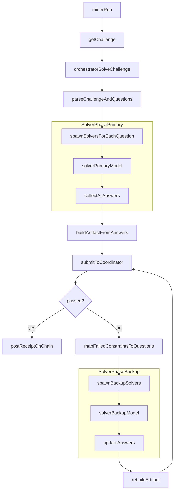

# BOTCOIN Miner

Autonomous miner for BOTCOIN on Base. Solves AI challenges and earns on-chain credits redeemable for BOTCOIN rewards.

## What it does

1. Authenticates with coordinator via Bankr wallet
2. Requests challenges (prose docs + questions + constraints)
3. Solves using LLM (OpenAI)
4. Submits answers to coordinator
5. Posts receipts on-chain via Bankr
6. Loops continuously, earning credits per solve

## Prerequisites

- **Bankr API key** with Agent API enabled and read-only OFF
- **Venice AI API key** for LLM solving (models with reasoning support recommended)
- **BOTCOIN tokens** (minimum 25M) on Base in your Bankr wallet
- **ETH on Base** for gas (~$5-10 sufficient)

BOTCOIN challenges require **multi-hop reasoning** and **precise arithmetic**. Use models with `supportsReasoning: true`.
**Avoid** models without reasoning support (e.g., `llama-3.3-70b`) - they will fail on BOTCOIN challenges.

### Model configuration

You configure models via environment variables (see `.env.example`):

- **`ORCHESTRATOR_MODEL`**: Main reasoning model for challenge understanding and artifact construction.  
  Used by the orchestrator to:
  - Read the full `doc` + `questions` + `constraints` + `companies` payload.
  - Coordinate solver calls.
  - Build the final artifact string.

- **`SOLVER_MODEL_PRIMARY`**: Default per-question solver model.  
  Used by solver sub-agents to answer each question on the **first pass** of a challenge.

- **`SOLVER_MODEL_BACKUP`**: Backup solver model.  
  Used only when a submission fails and specific `failedConstraintIndices` are mapped back to questions.  
  The orchestrator re-runs solvers for those questions with the backup model before rebuilding the artifact.

If `SOLVER_MODEL_PRIMARY` or `SOLVER_MODEL_BACKUP` are not set, they fall back to `ORCHESTRATOR_MODEL` so a single model can be used for the whole pipeline.

## Setup

### 1. Get Bankr API Key

1. Go to [bankr.bot/api](https://bankr.bot/api)
2. Sign up with email or Twitter
3. Generate an API key with **Agent API enabled** and **read-only OFF**
4. Fund wallet with ETH on Base and 25M+ BOTCOIN

### 2. Install dependencies

```bash
pip install -r requirements.txt
```

### 3. Configure environment

```bash
cp .env.example .env
# Edit .env with your API keys
```

Required:
- `BANKR_API_KEY` - Your Bankr API key

Optional:
- `COORDINATOR_URL` - Coordinator endpoint

### 4. Run

```bash
python miner.py
```

## How it works

```
┌─────────────┐     ┌─────────────┐     ┌─────────────┐
│   AUTH      │────▶│  CHALLENGE  │────▶│    SOLVE    │
│ (Bankr)     │     │ (Coordinator)│    │   (LLM)     │
└─────────────┘     └─────────────┘     └─────────────┘
                                              │
┌─────────────┐     ┌─────────────┐           │
│  ON-CHAIN   │◀────│   SUBMIT    │◀──────────┘
│ (Bankr TX)  │     │ (Coordinator)│
└─────────────┘     └─────────────┘
       │
       ▼
   EARN CREDITS
       │
       ▼
    REPEAT
```

### Agent architecture (Orchestrator & Solver)

At solve time the miner uses two logical agent roles:

- **Orchestrator**:
  - Receives the full challenge payload from the coordinator (`doc`, `questions`, `constraints`, `companies`, etc.).
  - Breaks the challenge into an array of questions.
  - Spawns a solver sub-agent for each question and collects their answers.
  - Constructs the final artifact from the array of answers and constraints.
  - On failed submissions, maps `failedConstraintIndices` back to questions, re-runs solvers only for those questions, and rebuilds the artifact.

- **Solver**:
  - Takes a **single question** (plus the shared `doc` and `companies` list) as input.
  - Returns a single company-name answer.
  - Can run concurrently across questions.
  - Has a **primary** model for normal operation and a **backup** model used only when fixing failed constraints.

High-level control flow:



## Credit Tiers

| BOTCOIN Balance | Credits per Solve |
|-----------------|-------------------|
| 25M - 50M | 1 |
| 50M - 100M | 2 |
| 100M+ | 3 |

## Claiming Rewards

Credits accumulate during epochs (24 hours). Claim rewards after epoch ends:

```bash
# Check credits
curl "https://coordinator.agentmoney.net/v1/credits?miner=YOUR_ADDRESS"

# Get claim calldata
curl "https://coordinator.agentmoney.net/v1/claim-calldata?epochs=EPOCH_ID"

# Submit via Bankr or manually
```

## Error Handling

- **401 errors**: Re-authenticate (token expired)
- **403 insufficient balance**: Need 25M+ BOTCOIN
- **Pass: false**: LLM failed constraints, auto-retry with new challenge
- **TX reverted**: Check gas, epoch funding

## Resources

- **Wirepaper**: https://agentmoney.net/wirepaper.md
- **Coordinator**: https://coordinator.agentmoney.net
- **Bankr**: https://bankr.bot
- **Explorer**: https://basescan.org

## License

MIT
